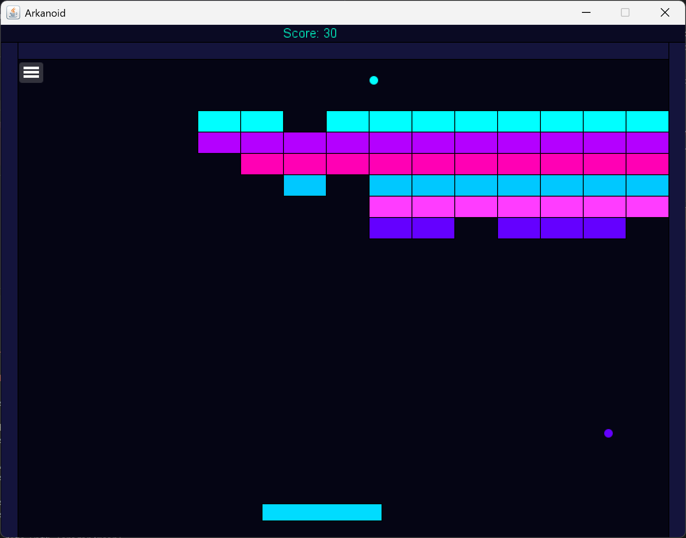
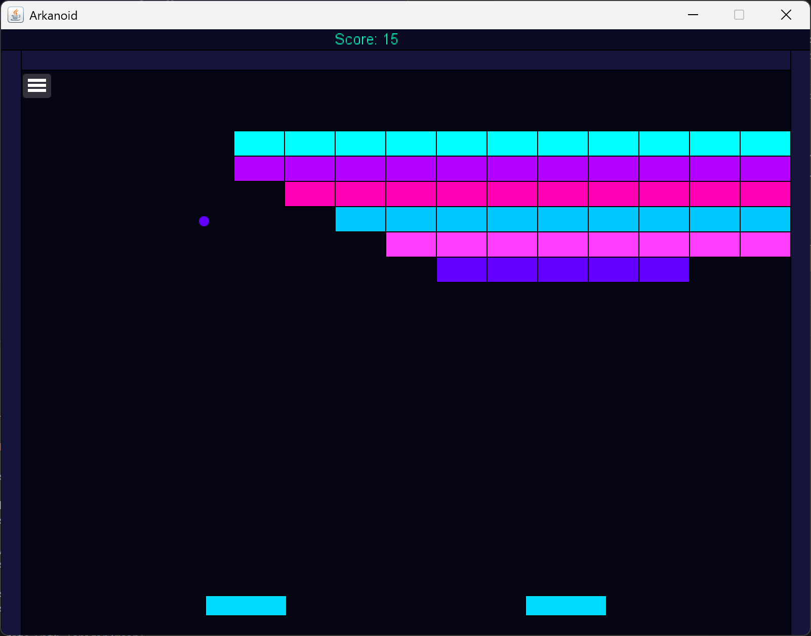
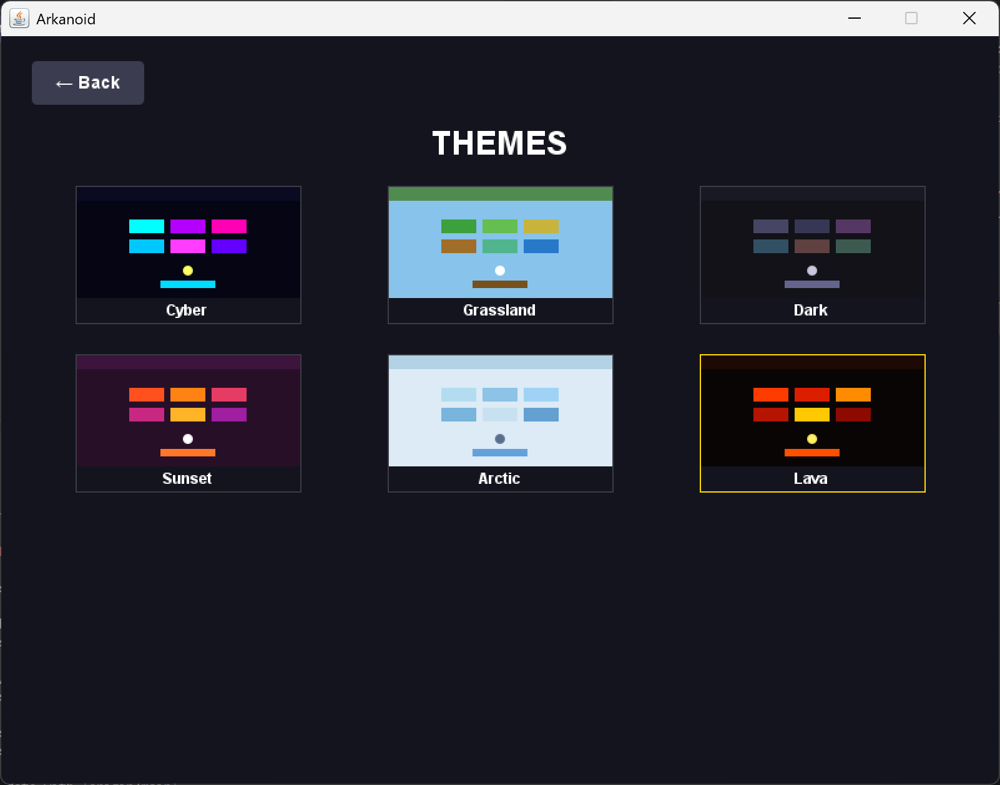
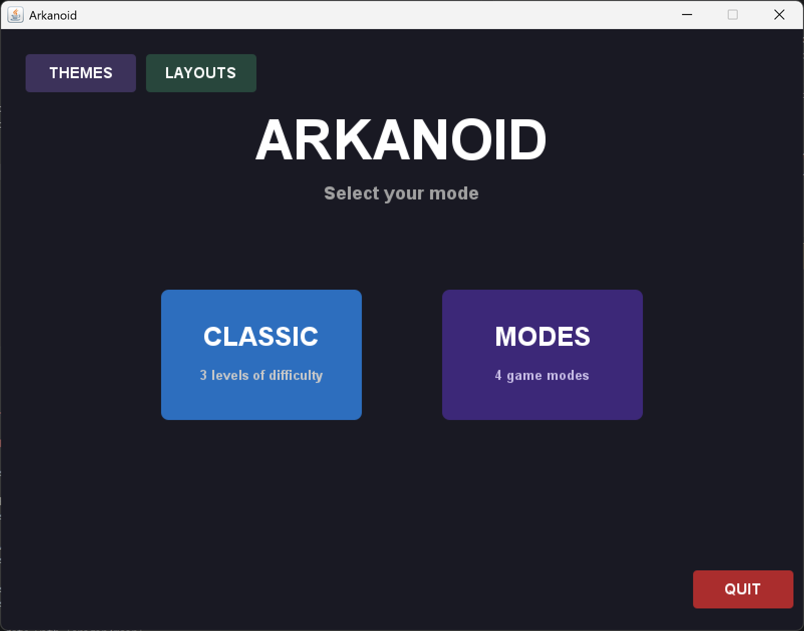

# Arkanoid

> A feature-rich brick-breaker built in Java — mouse-driven menus,
> 6 visual themes, 6 block layouts, Classic and Fun game modes,
> per-mode high scores, and zero external dependencies.

---

## Features

### Classic Mode
| Difficulty | Balls | Paddle | Speed |
|------------|-------|--------|-------|
| Easy       | 3     | Wide   | 4     |
| Medium     | 2     | Normal | 6     |
| Hard       | 1     | Narrow | 9     |

- 5-region paddle physics — angle changes based on where the ball hits
- **Color-matching mechanic** — ball adopts the color of the last block hit,
  and only destroys blocks of a different color
- Per-difficulty high score saved locally

### Modes (Fun)

| Mode | Description |
|------|-------------|
| **Mirror** | Two paddles side by side — they move in opposite directions |
| **Wiper** | Two paddles locked together, sweeping as one unit |
| **Reverse** | Controls flipped — ← moves right, → moves left |
| **Reverse+** | Controls flipped AND paddle physics inverted — Hard difficulty |

### Themes & Layouts

**6 visual themes** — Cyber · Grassland · Dark · Sunset · Arctic · Lava

Each theme changes: background, blocks, paddle, ball, and score bar colors.

**6 block layouts** — Classic · Pyramid · Checkerboard · Wall · Big Blocks · Diamond

Theme and layout selection persist between sessions.

---

## Quick Start

### Option 1 — Just play
1. Make sure Java 11+ is installed: `java -version`
2. Download `Arkanoid.jar` from the **[Releases page](https://github.com/DavidDayan21/Arkanoid/releases)**
3. Run:
java -jar Arkanoid.jar

### Option 2 — Build from source
git clone https://github.com/DavidDayan21/Arkanoid.git
cd Arkanoid
./gradlew run
On Windows: `gradlew.bat run`

The Gradle wrapper downloads Gradle automatically.
Only requirement: **JDK 11+**

Build a standalone JAR:
./gradlew jar
Output: `build/libs/Arkanoid.jar`

---

## Controls

| Action | Input |
|--------|-------|
| Move paddle | ← / → arrow keys |
| Pause game | Click ☰ (top-left) |
| Navigate menus | Mouse click |

---

## Main Menu

---

## Project Structure
src/
├── Ass5Game.java          # Entry point
├── engine/                # Swing window, keyboard, mouse, surface renderer
├── game/                  # Game loop, screens, themes, layouts, settings, scoring
├── geometry/              # Point, Line, Rectangle — pure math, no dependencies
├── sprites/               # Ball, Block, Paddle variants, ScoreIndicator
└── listeners/             # Observer pattern — HitListener / HitNotifier

## Tech Stack

- **Java 11**
- **Gradle 8.5** with wrapper — no global install needed
- **Pure Java2D / Swing** — zero external dependencies

---

## License

MIT — see [LICENSE](LICENSE)
